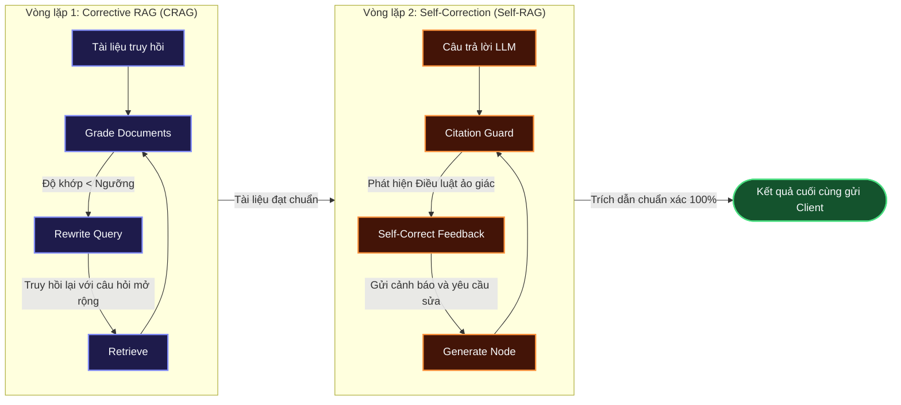

# HỆ THỐNG TRỢ LÝ HỎI ĐÁP PHÁP LUẬT VIỆT NAM (LEGAL QA SYSTEM)

> **Giải pháp Trợ lý AI Pháp lý tra cứu, phân tích và tư vấn quy định pháp luật Việt Nam — tất cả chạy trên 100% công cụ miễn phí & mã nguồn mở.**

[](https://www.python.org/)
[](https://fastapi.tiangolo.com/)
[](https://www.langchain.com/langgraph)
[](https://vitejs.dev/)
[](https://github.com/pgvector/pgvector)
[-000000?logo=ollama&logoColor=white)](https://ollama.com/)

Hệ thống Trợ lý Hỏi đáp Pháp luật Việt Nam là giải pháp trí tuệ nhân tạo chuyên sâu phục vụ tra cứu, phân tích và tư vấn quy định pháp luật dựa trên kiến trúc Retrieval-Augmented Generation (RAG) kết hợp Multi-Agent Workflow điều phối bởi LangGraph. Hệ thống đảm bảo tính chính xác pháp lý cao, hạn chế ảo giác nhờ cơ chế kiểm định trích dẫn đối chiếu trực tiếp với Cơ sở dữ liệu Văn bản Quy phạm Pháp luật Quốc gia.

---

## 1. TỔNG QUAN & MỤC TIÊU THIẾT KẾ

Hệ thống được phát triển theo các nguyên tắc thiết kế kỹ thuật nghiêm ngặt:

- **Grounded Citation (Bắt buộc trích dẫn có căn cứ):** Mọi luận điểm trả lời đều phải đi kèm Điều, Khoản, Điểm và tên văn bản quy phạm pháp luật cụ thể được truy xuất từ cơ sở dữ liệu.
- **Intent-Driven Routing (Định tuyến ý định thông minh):** Phân loại câu hỏi trước khi xử lý nhằm tối ưu tài nguyên tính toán (tách biệt câu hỏi pháp lý, chào hỏi xã giao và câu hỏi ngoài phạm vi).
- **Self-Hosted & Privacy-Preserving (Tự chủ vận hành):** Toàn bộ pipeline suy luận, embedding và cơ sở dữ liệu có khả năng vận hành nội bộ (On-Premise / Local), không phụ thuộc dịch vụ bên ngoài.
- **Single Source of Truth (Một nguồn cấu hình duy nhất):** Mọi thông số vận hành của toàn bộ hệ thống được tập trung trong file `config.yaml`.

---

## 2. KIẾN TRÚC HỆ THỐNG BACKEND

Hệ thống kết hợp **LangGraph StateGraph** (điều phối đa tác nhân) và **Hybrid RAG Engine** (truy hồi lai nâng cao).

---

### Sơ đồ 1: Luồng điều phối LangGraph (StateGraph Workflow)

```mermaid
flowchart TD
    Client["React Web UI"] --> Gateway["FastAPI Gateway"]
    Gateway --> START([START])

### Sơ đồ 1: Kiến trúc Hệ thống Agentic RAG Đa vòng lặp (CRAG & Self-RAG)

```mermaid
flowchart TD
    Client["Client / Người dùng (Web UI / Voice)"] --> Gateway["API Gateway (FastAPI)"]
    Gateway --> START([START])

    subgraph LangGraph ["LangGraph StateGraph (Agentic RAG Engine)"]
        START --> Router{"1. Intent Router"}
        Checkpointer[("MemorySaver")] -.-> Router

        Router -->|smalltalk| Smalltalk["2. Smalltalk Node"]
        Router -->|out_of_scope| OutScope["3. Out-of-Scope Node"]
        Router -->|legal_query| Decompose["4. Decompose Node<br/>(Spell + Tách vi phạm + HyDE)"]

        Decompose --> Retrieve["5. Retrieve Node<br/>(BM25 + pgvector + RRF + Reranker)"]
        Retrieve --> GradeDocs{"6. Grade Documents Node<br/>(Thẩm định độ phù hợp)"}

        %% VÒNG LẶP 1: Corrective RAG (CRAG)
        GradeDocs -->|"Không phù hợp (Score thấp)<br/>[CRAG Loop 1]"| RewriteQuery["7. Rewrite Query Node<br/>(Mở rộng & Viết lại thuật ngữ)"]
        RewriteQuery -->|Truy hồi lại| Retrieve

        GradeDocs -->|"Đạt chuẩn"| Generate["8. Generate Node<br/>(Smart Windowing + LLM 4 phần)"]
        Generate --> CitationGuard{"9. Citation Guard Node<br/>(Kiểm định trích dẫn)"}

        %% VÒNG LẶP 2: Self-Correction (Self-RAG)
        CitationGuard -->|"Phát hiện trích dẫn ảo<br/>[Self-RAG Loop 2]"| SelfCorrect["10. Self-Correct Node<br/>(Phản hồi nhắc nhở LLM)"]
        SelfCorrect -->|Sinh lại câu trả lời| Generate

        CitationGuard -->|"Hợp lệ 100%"| END([END])
        Smalltalk --> END
        OutScope --> END
    end

    subgraph Storage ["Storage & Knowledge"]
        DB[("PostgreSQL (pgvector)")]
        BM25Cache[("BM25 Index Cache")]
        Sessions[("Session Storage")]
    end

    Retrieve -.-> DB
    Retrieve -.-> BM25Cache
    CitationGuard -.-> DB
    Gateway -.-> Sessions

    END --> Output["Phản hồi người dùng"]

    classDef clientStyle fill:#0f172a,stroke:#38bdf8,stroke-width:2px,color:#f8fafc;
    classDef graphStyle fill:#1e1b4b,stroke:#818cf8,stroke-width:2px,color:#f8fafc;
    classDef ragStyle fill:#14532d,stroke:#4ade80,stroke-width:2px,color:#f8fafc;
    classDef loopStyle fill:#701a75,stroke:#f472b6,stroke-width:2px,color:#f8fafc;
    classDef dbStyle fill:#311042,stroke:#c084fc,stroke-width:2px,color:#f8fafc;

    class Client,Gateway,Output clientStyle;
    class START,Router,Smalltalk,OutScope,Checkpointer,END graphStyle;
    class Decompose,Retrieve,Generate ragStyle;
    class GradeDocs,RewriteQuery,CitationGuard,SelfCorrect loopStyle;
    class DB,BM25Cache,Sessions dbStyle;
```

---

### Sơ đồ 2: Luồng Tự Động Phản Hồi & Tự Sửa Sai (CRAG & Self-RAG Loops)



---

### Tóm tắt Kỹ thuật Backend

#### 1. LangGraph StateGraph (Agentic RAG Đa vòng lặp)
- **`LegalAgentState`:** Cấu trúc dữ liệu trung tâm lưu `query`, `intent`, `standalone_query`, `sub_queries`, `retrieved_docs`, `docs_grade`, `retry_count`, `citations`, `answer`, `guard_status`, `hallucinated_articles`, `correction_feedback`, `hypothetical_passage`, `history`.
- **Định tuyến (Intent Router):** Phân loại câu hỏi bằng Few-shot LLM rẽ 3 nhánh:
  - `smalltalk` ➔ `Smalltalk Node`: Phản hồi xã giao nhanh, không gọi DB.
  - `out_of_scope` ➔ `Out-of-Scope Node`: Từ chối lịch sự câu hỏi phi pháp luật.
  - `legal_query` ➔ Kích hoạt đồ thị Agentic RAG gồm 7 node con.
- **Vòng lặp 1 - Corrective RAG (CRAG Loop):**
  - `grade_documents_node`: Đánh giá mức độ khớp ngữ nghĩa và từ khóa giữa tài liệu và truy vấn.
  - Nếu tài liệu không đạt yêu cầu ➔ Chuyển qua `rewrite_query_node` để mở rộng thuật ngữ pháp lý và quay lại `retrieve_node` (tối đa 2 lần).
- **Vòng lặp 2 - Self-Correction (Self-RAG Loop):**
  - `citation_guard_node`: Đối chiếu toàn bộ số hiệu Điều/Khoản sinh ra với tài liệu gốc trong context.
  - Nếu phát hiện ảo giác (hallucination) ➔ Chuyển qua `self_correct_node` tạo phản hồi cảnh báo chi tiết và quay lại `generate_node` để LLM sinh lại (tối đa 2 lần).
- **Trí nhớ phiên:** `MemorySaver Checkpointer` (trạng thái runtime đồ thị) kết hợp `SessionManager` (lưu trữ file JSON bền vững đa phiên).

#### 2. Advanced Hybrid RAG Engine
- **Tiền xử lý:** Sửa chính tả (`SpellCorrector`), bóc tách câu hỏi đa hành vi (`QueryDecomposer`) và sinh văn bản giả định (`HyDE`).
- **Truy hồi song song:** Dense Search (BGE-M3 qua pgvector PostgreSQL, Top 30) + Sparse Search (BM25 Okapi trên RAM, Top 30).
- **Hợp nhất RRF:** Hòa trộn thứ hạng với $k=60$ lấy Top 15:
  $$RRF(d) = \frac{1}{60 + \text{rank}_{\text{Dense}}(d)} + \frac{1}{60 + \text{rank}_{\text{BM25}}(d)}$$
- **Tái xếp hạng:** Cross-Encoder `BGE-Reranker-Large` / `FlashRank` lọc chọn Top 3-5 Điều luật chuẩn xác nhất.
- **Smart Windowing:** Tự động lọc đúng Khoản vi phạm và gom thêm các Khoản hình phạt bổ sung (tước GPLX, tạm giữ phương tiện...).
- **Tổng hợp 4 phần:** LLM Qwen 2.5 sinh câu trả lời gồm: (1) Kết luận, (2) Căn cứ pháp lý, (3) Phân tích áp dụng (tự động cộng dồn mức phạt nếu đa vi phạm), (4) Hướng dẫn thực tiễn.

---

## 3. CÁC TÍNH NĂNG NỔI BẬT

- **Truy hồi lai (Hybrid Retrieval):** Kết hợp tìm kiếm vector tương đồng ngữ nghĩa (Dense Vector Search qua pgvector) và tìm kiếm từ khóa tần suất cao (BM25 Sparse Search) sử dụng thuật toán Reciprocal Rank Fusion (RRF).
- **Hypothetical Document Embeddings (HyDE):** Tự động sinh văn bản giả định trước khi nhúng vector, giúp thu hẹp khoảng cách ngữ nghĩa giữa câu hỏi người dùng và văn bản quy phạm pháp luật.
- **Xử lý câu hỏi phức hợp (Multi-Violation Decomposition):** Nhận diện các tình huống chứa nhiều hành vi vi phạm khác nhau, tự động chia nhỏ thành các truy vấn đơn lẻ để truy hồi đầy đủ trước khi tổng hợp lời giải.
- **Xử lý tiếng Việt chuyên sâu:** Tích hợp bộ tiền xử lý `underthesea` chuẩn hóa chính tả, tách từ tiếng Việt trước khi tính toán trọng số tìm kiếm.
- **Reranker tái xếp hạng:** Sử dụng Cross-Encoder / Smart Fallback Reranking để lọc lấy các đoạn văn bản có độ liên quan cao nhất trước khi đưa vào ngữ cảnh LLM.
- **Citation Guard:** Tầng kiểm duyệt độc lập rà soát văn bản sinh ra, đảm bảo các căn cứ Điều/Khoản được trích dẫn thực sự tồn tại trong tài liệu đã truy hồi.
- **Kiểm tra nguồn văn bản gốc (Source Inspector):** Cửa sổ tra cứu trực tiếp toàn văn điều luật theo thời gian thực mà không cần rời khỏi giao diện.
- **Trợ lý phát thanh (Voice AI):** Tích hợp đọc câu trả lời bằng giọng tiếng Việt truyền cảm (Hoài My - chuẩn tin tức, Nam Minh - chuẩn giọng đọc).
- **Quản lý đa phiên hội thoại (Multi-Session):** Tạo mới, đổi tên, lưu trữ lịch sử ngữ cảnh nhiều lượt hỏi đáp và xóa phiên theo nhu cầu.

---

## 4. CẤU TRÚC THƯ MỤC

```
legal-qa-system/
|-- config.yaml                 # File cấu hình tập trung duy nhất cho hệ thống
|-- docker-compose.yml          # Kịch bản triển khai toàn bộ hệ thống bằng Docker
|
|-- backend/                    # Mã nguồn máy chủ Backend (FastAPI + LangGraph)
|   |-- Dockerfile              # Dockerfile cho backend
|   |-- requirements.txt        # Danh mục thư viện phụ thuộc Python
|   |-- pyproject.toml          # Cấu hình gói và phụ thuộc chuẩn
|   |-- data/
|   |   |-- base_data.json      # Cơ sở dữ liệu gốc chứa các điều luật
|   |   |-- cache/              # Cache chỉ mục BM25 (bm25_index_cache.json)
|   |   `-- sessions/           # Lưu trữ ngữ cảnh lịch sử các phiên hội thoại
|   |-- docker/
|   |   `-- postgres/
|   |       `-- init.sql        # Script khởi tạo extension pgvector cho PostgreSQL
|   |-- notebooks/              # Thí nghiệm R&D và benchmark đánh giá
|   |   |-- 00_data_exploration.ipynb
|   |   |-- 01_chunking_experiments.ipynb
|   |   |-- 02_retrieval_evaluation.ipynb
|   |   |-- 03_rag_agent_evaluation.ipynb
|   |   `-- 04_latency_benchmark.ipynb
|   |-- scripts/                # Tiện ích vận hành và nạp dữ liệu
|   |   |-- load_postgres.py    # Script nạp dữ liệu từ JSON vào PostgreSQL
|   |   `-- interactive_chat.py # Giao diện hỏi đáp trên dòng lệnh (CLI)
|   |-- tests/                  # Bộ kiểm thử chuyên biệt hệ thống
|   |   |-- test_agentic_rag.py # Kiểm thử 100% các vòng lặp CRAG & Self-RAG
|   |   |-- test_api.py         # Kiểm thử toàn diện REST API, Health check & Session
|   |   |-- test_agent.py       # Kiểm tra luồng chạy agent
|   |   |-- test_retrieval.py   # Kiểm tra độ chính xác của tầng truy hồi
|   |   `-- test_session_and_voice.py # Kiểm tra API phiên và giọng nói
|   `-- src/
|       |-- config.py           # Bộ nạp cấu hình từ config.yaml
|       |-- ingestion/          # Pipeline xử lý & chuẩn hóa dữ liệu pháp lý
|       |   |-- schema.py       # Định nghĩa lược đồ dữ liệu điều luật
|       |   |-- converter.py    # Chuyển đổi và phân tích cú pháp văn bản
|       |   `-- crawler.py      # Thu thập dữ liệu văn bản pháp luật
|       |-- agent/              # Định nghĩa LangGraph Agent & Nodes
|       |   |-- graph.py        # Đồ thị trạng thái chính của hệ thống (10 Nodes)
|       |   |-- state.py        # Định nghĩa cấu trúc AgentState (Hỗ trợ 2 feedback loops)
|       |   |-- llm_client.py   # Client kết nối Ollama / vLLM
|       |   |-- session_manager.py # Quản lý phiên hội thoại
|       |   `-- nodes/          # 10 Nút xử lý mô-đun trong đồ thị Agentic RAG
|       |       |-- intent_router.py        # 1. Phân loại ý định người dùng
|       |       |-- smalltalk_node.py       # 2. Xử lý chào hỏi xã giao
|       |       |-- out_of_scope_node.py    # 3. Xử lý từ chối ngoài phạm vi
|       |       |-- decompose_node.py       # 4. Sửa chính tả, tách đa vi phạm & HyDE
|       |       |-- retrieve_node.py        # 5. Thực thi truy hồi đa truy vấn
|       |       |-- grade_documents_node.py # 6. Thẩm định độ phù hợp tài liệu (CRAG)
|       |       |-- rewrite_query_node.py   # 7. Mở rộng & viết lại truy vấn (CRAG Loop)
|       |       |-- generate_node.py        # 8. Sinh câu trả lời chuẩn 4 phần
|       |       |-- citation_guard_node.py  # 9. Kiểm định trích dẫn thực tế
|       |       `-- self_correct_node.py    # 10. Phản hồi tự sửa sai (Self-RAG Loop)
|       |-- api/
|       |   `-- main.py         # Điểm khởi chạy FastAPI, định tuyến REST và SSE
|       |-- retrieval/          # Tầng truy xuất dữ liệu (Hybrid RAG Engine)
|       |   |-- hybrid_retriever.py # Hợp nhất kết quả Dense + Sparse (RRF)
|       |   |-- vector_client.py    # Truy xuất vector qua PostgreSQL pgvector
|       |   |-- keyword_store.py    # Truy xuất từ khóa qua BM25 Okapi
|       |   |-- reranker.py         # Tái xếp hạng tài liệu (Cross-Encoder)
|       |   |-- hyde.py             # Sinh văn bản pháp luật giả định (HyDE)
|       |   |-- spell_corrector.py  # Sửa lỗi chính tả pháp lý
|       |   |-- query_decomposer.py # Tách câu hỏi đa hành vi vi phạm
|       |   |-- query_rewriter.py   # Viết lại câu hỏi kèm lịch sử hội thoại
|       |   `-- text_normalizer.py  # Chuẩn hóa tiếng Việt và dấu thanh
|       `-- services/
|           `-- voice_service.py # Dịch vụ chuyển văn bản thành giọng nói (TTS)
|
`-- frontend/                   # Ứng dụng giao diện người dùng (React + Vite)
    |-- Dockerfile              # Dockerfile đóng gói frontend
    |-- nginx.conf              # Cấu hình Nginx phục vụ production
    |-- index.html              # HTML template chính
    |-- package.json            # Quản lý phụ thuộc Node.js
    |-- vite.config.ts          # Cấu hình Vite bundler & reverse proxy
    `-- src/
        |-- App.tsx             # Component giao diện chính
        |-- main.tsx            # Điểm khởi tạo ứng dụng React
        `-- index.css           # Cấu hình Tailwind CSS và giao diện
```

---

## 5. YÊU CẦU MÔI TRƯỜNG

Trước khi cài đặt, hãy đảm bảo máy tính đã được cài đặt các công cụ sau:

- **Hệ điều hành:** Linux, macOS, hoặc Windows (hỗ trợ tốt trên PowerShell / WSL2)
- **Python:** Phiên bản 3.10 trở lên
- **Node.js:** Phiên bản 18.x trở lên cùng trình quản lý gói `npm`
- **PostgreSQL:** Phiên bản 16 hoặc 17 có cài đặt extension `pgvector` (Khuyến nghị chạy qua Docker)
- **Ollama:** Phục vụ mô hình LLM và Embedding cục bộ

---

## 6. HƯỚNG DẪN CÀI ĐẶT & KHỞI CHẠY

### Bước 1: Cài đặt và cấu hình Ollama (LLM & Embedding)

Hệ thống sử dụng Ollama để chạy các mô hình nguồn mở. Tải và cài đặt Ollama từ trang chủ `https://ollama.com`.

Khởi động dịch vụ Ollama và tải về các mô hình cần thiết:

```bash
# Tải mô hình ngôn ngữ lớn (LLM) phục vụ suy luận
ollama pull qwen2.5:3b

# Tải mô hình biểu diễn véc-tơ (Embedding)
ollama pull nomic-embed-text
```

Kiểm tra dịch vụ Ollama hoạt động tại địa chỉ: `http://localhost:11434`

---

### Bước 2: Khởi tạo Cơ sở Dữ liệu PostgreSQL (pgvector)

Cách nhanh nhất là sử dụng Docker để khởi chạy PostgreSQL kèm extension `pgvector` đã được định cấu hình cổng `23432`:

```bash
# Tại thư mục gốc legal-qa-system
docker compose up -d postgres
```

Nếu cài đặt PostgreSQL thủ công trên máy cục bộ, hãy đảm bảo tạo cơ sở dữ liệu và kích hoạt các extension:

```sql
CREATE DATABASE legal_assistant;
\c legal_assistant;
CREATE EXTENSION IF NOT EXISTS "uuid-ossp";
CREATE EXTENSION IF NOT EXISTS "unaccent";
CREATE EXTENSION IF NOT EXISTS "pg_trgm";
CREATE EXTENSION IF NOT EXISTS "vector";
```

---

### Bước 3: Nạp dữ liệu pháp luật (Data Ingestion)

Tiến hành nạp toàn bộ các điều luật từ tập tin `base_data.json` vào cơ sở dữ liệu PostgreSQL:

```bash
# Di chuyển vào thư mục backend
cd backend

# Khởi tạo môi trường ảo Python
python -m venv .venv

# Kích hoạt môi trường ảo:
# Trên Windows PowerShell:
.venv\Scripts\Activate.ps1
# Trên Linux / macOS:
source .venv/bin/activate

# Cài đặt các gói phụ thuộc
pip install -r requirements.txt

# Thực thi script nạp dữ liệu
python scripts/load_postgres.py
```

Sau khi hoàn tất, hệ thống sẽ xác nhận số lượng bản ghi đã được nạp thành công vào bảng `legal_knowledge_records`.

---

### Bước 4: Khởi chạy Backend (FastAPI)

Đảm bảo môi trường ảo Python vẫn đang được kích hoạt tại thư mục `backend`:

```bash
# Khởi chạy máy chủ API tại cổng 8000
python -m uvicorn src.api.main:app --host 0.0.0.0 --port 8000 --reload
```

- Địa chỉ kiểm tra tình trạng hệ thống: `http://127.0.0.1:8000/health`
- Tài liệu giao diện Swagger UI: `http://127.0.0.1:8000/docs`

---

### Bước 5: Khởi chạy Frontend (React + Vite)

Mở một cửa sổ dòng lệnh (Terminal) mới và thực hiện:

```bash
# Di chuyển vào thư mục frontend
cd frontend

# Cài đặt các thư viện phụ thuộc Node.js
npm install

# Khởi chạy máy chủ phát triển
npm run dev
```

Truy cập ứng dụng tại địa chỉ: `http://localhost:5173`

---

### TÙY CHỌN: Chạy toàn bộ hệ thống bằng Docker Compose

Hệ thống cung cấp sẵn file `docker-compose.yml` để đóng gói và vận hành đồng thời Database, Backend và Frontend trong container:

```bash
# Tại thư mục legal-qa-system
docker compose up --build -d
```

Các dịch vụ sẽ sẵn sàng tại:
- Frontend UI: `http://localhost:3000`
- Backend API: `http://localhost:8000`
- PostgreSQL: `localhost:23432`

---

## 7. TÀI LIỆU CẤU HÌNH (config.yaml)

File `config.yaml` tại thư mục gốc quản lý toàn bộ tham số hoạt động:

| Tham số | Giá trị mặc định | Giải thích |
|---|---|---|
| `app.host` / `app.port` | `0.0.0.0:8000` | Địa chỉ mạng và cổng lắng nghe của máy chủ Backend |
| `ui.host` / `ui.port` | `0.0.0.0:5173` | Cổng phát triển của Frontend |
| `llm.base_url` | `http://localhost:11434/v1` | Endpoint tương thích OpenAI của dịch vụ LLM |
| `llm.default_model` | `qwen2.5:3b` | Mô hình ngôn ngữ lớn dùng để tổng hợp câu trả lời |
| `llm.temperature` | `0.1` | Độ ngẫu nhiên của mô hình (thấp để tăng tính chính xác) |
| `embeddings.base_url` | `http://localhost:11434/v1` | Endpoint của dịch vụ trích xuất vector đặc trưng |
| `embeddings.model` | `nomic-embed-text` | Mô hình biểu diễn vector cho truy vấn và tài liệu |
| `legal_assistant.chat.streaming` | `true` | Cho phép stream kết quả theo thời gian thực (SSE) |
| `legal_assistant.retrieval.top_k` | `20` | Số lượng tài liệu sơ tuyển ban đầu |
| `legal_assistant.retrieval.rerank_top_k` | `5` | Số tài liệu chính xác nhất giữ lại sau tái xếp hạng |
| `legal_assistant.retrieval.fusion_method`| `rrf` | Phương pháp kết hợp kết quả: Reciprocal Rank Fusion |
| `legal_assistant.hyde.enabled` | `true` | Bật/tắt kỹ thuật sinh tài liệu giả định HyDE |
| `legal_assistant.reranker.enabled` | `true` | Kích hoạt bộ tái xếp hạng Cross-Encoder |
| `legal_assistant.postgres.database_url` | `postgresql://...` | Chuỗi kết nối đến cơ sở dữ liệu PostgreSQL |

---

## 8. DANH MỤC API ENDPOINTS

Hệ thống cung cấp hệ thống REST API và Streaming SSE tiêu chuẩn:

| Phương thức | Đường dẫn Endpoint | Chức năng |
|---|---|---|
| `GET` | `/health` | Kiểm tra trạng thái hoạt động của Backend và cơ sở dữ liệu |
| `POST` | `/chat` | Gửi câu hỏi pháp lý và nhận câu trả lời đồng bộ |
| `POST` | `/chat/stream` | Hỏi đáp dạng truyền dữ liệu liên tục Server-Sent Events (SSE) |
| `GET` | `/articles/lookup` | Tra cứu nguyên văn điều luật theo số hiệu hoặc trích dẫn |
| `GET` | `/sessions` | Lấy danh sách toàn bộ các phiên hội thoại |
| `POST` | `/sessions` | Khởi tạo phiên hội thoại mới |
| `GET` | `/sessions/{id}` | Lấy lại toàn bộ lịch sử tin nhắn của một phiên |
| `DELETE` | `/sessions/{id}` | Xóa một phiên hội thoại cụ thể |
| `DELETE` | `/sessions` | Xóa tất cả các phiên hội thoại |
| `GET` | `/voice/voices` | Danh sách giọng đọc hỗ trợ (Hoài My, Nam Minh) |
| `POST` | `/voice/tts` | Chuyển văn bản câu trả lời thành file âm thanh giọng nói MP3 |

---

## 9. KIỂM THỬ & ĐO LƯỜNG CHẤT LƯỢNG

Hệ thống cung cấp sẵn các bộ công cụ kiểm thử độc lập trong `backend/tests/` và tiện ích dòng lệnh trong `backend/scripts/`:

1. **Thử nghiệm tương tác trên dòng lệnh (CLI):**
   ```bash
   python scripts/interactive_chat.py
   ```
2. **Kiểm thử tầng REST API & Health Check (FastAPI TestClient):**
   ```bash
   python tests/test_api.py
   ```
3. **Kiểm tra luồng điều phối tác nhân LangGraph (Agent Pipeline):**
   ```bash
   python tests/test_agent.py
   ```
4. **Kiểm tra tầng truy hồi thông tin (Retrieval Precision):**
   ```bash
   python tests/test_retrieval.py
   ```
5. **Kiểm tra tính năng lưu trữ phiên và giọng nói:**
   ```bash
   python tests/test_session_and_voice.py
   ```

---

## 10. MIỄN TRỪ TRÁCH NHIỆM

> [!WARNING]
> **Lưu ý quan trọng về giá trị pháp lý:**
> - **Mục đích tham khảo:** Hệ thống được phát triển phục vụ mục đích nghiên cứu, học tập và tra cứu thông tin tham khảo.
> - **Không thay thế tư vấn pháp lý:** Câu trả lời do AI sinh ra không cấu thành ý kiến tư vấn pháp lý chính thức và không có giá trị pháp lý thay thế cơ quan nhà nước có thẩm quyền hoặc luật sư hành nghề.
> - **Đối chiếu văn bản gốc:** Người dùng cần kiểm tra, đối chiếu lại với văn bản quy phạm pháp luật hiện hành mới nhất trước khi đưa ra các quyết định trong thực tế.
> - **Giới hạn trách nhiệm:** Tác giả / Nhóm phát triển không chịu trách nhiệm đối với bất kỳ rủi ro hay thiệt hại nào phát sinh từ việc sử dụng thông tin do hệ thống cung cấp.

---

## 11. BẢN QUYỀN & LIÊN HỆ

Dự án được xây dựng phục vụ mục đích học tập, nghiên cứu và phát triển giải pháp ứng dụng trí tuệ nhân tạo trong lĩnh vực pháp lý tại Việt Nam. Dữ liệu văn bản quy phạm pháp luật được trích xuất từ các nguồn công khai chính thức của Nhà nước.
