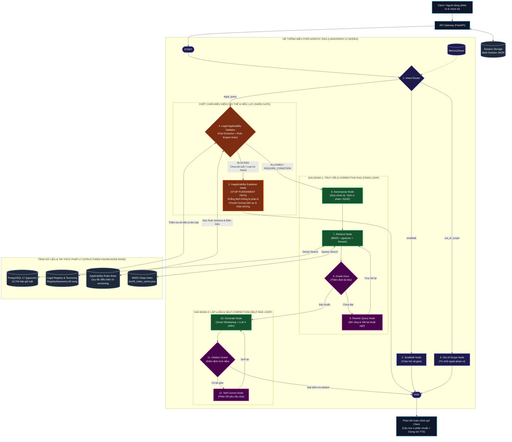

# HỆ THỐNG TRỢ LÝ HỎI ĐÁP PHÁP LUẬT VIỆT NAM (LEGAL QA SYSTEM)

> **Giải pháp Trợ lý AI Pháp lý tra cứu, phân tích và tham khảo quy định pháp luật Việt Nam — Tích hợp Kiến trúc Thẩm định 4 lớp (4-Layer Validation) và Động cơ Quy tắc Pháp lý Dựa trên Dữ liệu (Data-Driven Rule Engine), có thể triển khai nội bộ tùy cấu hình hạ tầng.**

[](https://www.python.org/)
[](https://fastapi.tiangolo.com/)
[](https://www.langchain.com/langgraph)
[](https://vitejs.dev/)
[](https://github.com/pgvector/pgvector)
[](backend/docker/postgres/init.sql)
[-000000?logo=ollama&logoColor=white)](https://ollama.com/)

Hệ thống Trợ lý Hỏi đáp Pháp luật Việt Nam là giải pháp trí tuệ nhân tạo phục vụ tra cứu, phân tích và tham khảo quy định pháp luật dựa trên kiến trúc **Agentic RAG Đa vòng lặp (Multi-Loop Agentic RAG)** kết hợp **Động cơ Thẩm tra Điều kiện Áp dụng Pháp luật (Legal Applicability & Rule Engine)** điều phối bởi LangGraph. Hệ thống phân biệt **"Relevant" (Tương đồng ngữ nghĩa)** và **"Applicable" (Khả năng áp dụng trên thực tế)**, đồng thời hỗ trợ phát hiện các rủi ro như tiền đề thiếu căn cứ, số điều không tồn tại hoặc điều kiện chủ thể không phù hợp. Hiệu quả thực tế cần được đánh giá trên tập kiểm thử và benchmark tương ứng.

---

## 1. TỔNG QUAN & NGUYÊN TẮC THIẾT KẾ CỐT LÕI

Hệ thống được xây dựng dựa trên 6 nguyên tắc thiết kế kỹ thuật nghiêm ngặt:

1. **Phân định rạch ròi giữa "Relevant" và "Applicable":** Truy hồi được văn bản liên quan không đồng nghĩa với việc văn bản đó được phép áp dụng cho chủ thể cụ thể. Hệ thống tích hợp **Legal Applicability Gate** để kiểm tra một số điều kiện chủ thể được mô hình hóa trong rule engine (ví dụ: tuổi chịu trách nhiệm hình sự), qua đó giảm nguy cơ áp dụng sai trong các kịch bản đã được kiểm thử.
2. **Data-Driven Legal Rule Engine (Không hardcode luật vào code):** Toàn bộ quy tắc về độ tuổi, điều kiện áp dụng, thẩm quyền và thời hiệu pháp lý được lưu trữ dưới dạng schema JSON trong bảng CSDL `legal_applicability_rules` (PostgreSQL), cho phép cập nhật và bổ sung version luật mới mà không cần sửa đổi mã nguồn.
3. **Phát hiện Mơ hồ Dữ kiện (Fact Ambiguity Detection):** Tự động phát hiện và cảnh báo các dữ kiện định tính chưa đủ căn cứ định khung (ví dụ: *"đánh bạn trọng thương"* là mô tả thực tế, cần kết luận giám định tỷ lệ tổn thương cơ thể `%` chính thức của cơ quan y tế).
4. **Structured Knowledge Base & Anti-Hallucination:** Bộ dữ liệu `backend/data/base_data.json` hiện có 13.744 bản ghi điều luật thuộc 223 `law_id` khác nhau. Registry/taxonomy là các bảng bổ sung; số lượng thực tế cần được xác nhận sau khi chạy script seed.
5. **Grounded Citation (Bắt buộc trích dẫn có căn cứ):** Mọi câu trả lời bắt buộc tuân theo cấu trúc 4 phần chuẩn mực (Kết luận $\rightarrow$ Căn cứ pháp lý $\rightarrow$ Phân tích & Chi tiết áp dụng $\rightarrow$ Hướng dẫn & Lưu ý thực tiễn), đối chiếu trực tiếp với tài liệu gốc qua Citation Guard độc lập.
6. **Self-Hosted & Privacy-Preserving:** LLM, embedding, PostgreSQL, BM25 và reranker có thể vận hành cục bộ. Cấu hình TTS mặc định hiện dùng `edge-tts` nên cần kết nối bên ngoài; để triển khai offline/on-premise cần chuyển sang `local_http` và cung cấp một TTS server nội bộ. Mức độ bảo mật phụ thuộc vào cấu hình mạng, phân quyền và vận hành thực tế.


> 📖 **Tài liệu kỹ thuật chuyên sâu:**
> - [Kiến trúc Hệ thống Chi tiết](docs/01-kien-truc-he-thong.md): Đặc tả phân tầng điều phối LangGraph, Hybrid Search, Smart Windowing, và cơ chế Citation Guard.
> - [Lộ trình Thực hiện Dự án](docs/02-lo-trinh-thuc-hien.md): Chi tiết 9 giai đoạn từ chuẩn bị dữ liệu, phát triển lõi đến tối ưu production.
> - [Quy trình Ingestion & Quản lý Hiệu lực](docs/03-quy-trinh-ingestion-va-hieu-luc.md): Quy trình 5 giai đoạn nạp văn bản, sinh vector nhúng và cơ chế cập nhật hiệu lực văn bản pháp luật.

---

## 2. KIẾN TRÚC HỆ THỐNG BACKEND

Hệ thống kết hợp **LangGraph StateGraph 12 Nodes** (điều phối tác nhân đa vòng lặp), **Khung Thẩm định 4 lớp (4-Layer Legal Validation Framework)** và **Advanced Hybrid RAG Engine**.

---

### Sơ đồ Tổng thể Kiến trúc Hệ thống Agentic RAG & Legal Rule Engine Gate



---

### Tóm tắt Kỹ thuật Backend

#### 1. Khung Thẩm định Pháp lý 4 Lớp (4-Layer Legal Validation Framework)
Hệ thống vận hành theo quy trình kiểm tra bậc thang trước khi câu trả lời được phép phát hành tới người dùng:
1. **Lớp 1 - Reference Validator (`src/domain/premise_checker.py` & `src/domain/legal_registry.py`):** Kiểm tra số Điều và tên Văn bản dựa trên registry/taxonomy đã seed và tập dữ liệu 13.744 bản ghi. Số lượng registry thực tế cần được xác nhận từ database sau khi seed.
2. **Lớp 2 - Fact Validator & Ambiguity Detection (`src/domain/fact_extractor.py`):** Bóc tách sự kiện pháp lý (`age`, `action`, `victim`, `injury_percentage`, `injury_description`, `requested_info`). Phát hiện **Fact Ambiguity**: Nhận diện dữ kiện *"trọng thương"* là mô tả định tính, chưa có kết luận giám định tỷ lệ tổn thương cơ thể (%) chính thức.
3. **Lớp 3 - Legal Applicability Validator & Hard Gate (`src/domain/rule_engine.py`):** Thực thi các quy tắc điều kiện áp dụng từ PostgreSQL (`legal_applicability_rules`). Nếu chủ thể không thỏa mãn điều kiện pháp lý trong các rule đã được cấu hình (ví dụ: người dưới 14 tuổi bị hỏi phạt tù), kích hoạt **Hard Gate (`status = BLOCKED`)** chuyển sang `inapplicability_node`, giúp tránh tiếp tục tính toán theo nhánh không phù hợp.
4. **Lớp 4 - Evidence Validator & Citation Guard (`src/agent/nodes/grade_documents_node.py` & `src/agent/nodes/citation_guard_node.py`):** Thẩm định bằng chứng trích lục (CRAG) và rà soát đối chiếu trích dẫn chống ảo giác (Self-RAG).

#### 2. LangGraph StateGraph (12 Nodes với 3 Cơ chế Kiểm soát)
- **`LegalAgentState`:** Quản lý tập trung `query`, `intent`, `legal_facts`, `eligibility_status`, `blocking_factors`, `applicable_rules`, `fact_ambiguities`, `legal_decision`, `retrieved_docs`, `docs_grade`, `retry_count`, `citations`, `answer`, `guard_status`, `hallucinated_articles`, `correction_feedback`, `hypothetical_passage`, `history`.
- **Cơ chế 1 - Hard Gate Chốt chặn Chủ thể:** Rẽ nhánh trực tiếp khi vi phạm quy tắc loại trừ trách nhiệm hình sự (Điều 12 BLHS và Luật Tư pháp người chưa thành niên 2024 có hiệu lực 2026), kết thúc luồng với câu trả lời khẳng định không bị phạt tù và hướng dẫn biện pháp dân sự (Điều 586 BLDS 2015) / giáo dưỡng (Luật XLVPHC).
- **Cơ chế 2 - Corrective RAG (CRAG Loop):** `grade_documents_node` $\rightarrow$ `rewrite_query_node` $\rightarrow$ `retrieve_node` (tối đa 2 vòng lặp).
- **Cơ chế 3 - Self-Correction (Self-RAG Loop):** `citation_guard_node` $\rightarrow$ `self_correct_node` $\rightarrow$ `generate_node` (tối đa 2 vòng lặp).

#### 3. Advanced Hybrid RAG Engine
- **Tiền xử lý:** Sửa chính tả (`SpellCorrector`), bóc tách câu hỏi đa hành vi (`QueryDecomposer`) và sinh văn bản giả định (`HyDE`).
- **Truy hồi song song:** Dense Search qua pgvector và Sparse Search BM25 trên RAM. Schema mặc định khai báo `vector(768)` và HNSW; script `add_vector_column.py` đo chiều vector từ embedding endpoint trước khi tạo cột, nên cần kiểm tra database thực tế sau ingestion. Candidate pool được tính động.
- **Hợp nhất RRF:** Hòa trộn thứ hạng với $k=60$ lấy Top 15:
  $$RRF(d) = \frac{1}{60 + \text{rank}_{\text{Dense}}(d)} + \frac{1}{60 + \text{rank}_{\text{BM25}}(d)}$$
- **Tái xếp hạng (Reranking):** Kết hợp thuật toán **Smart Fallback** (phân tích tương quan cụm từ N-gram, mật độ từ khóa và ngữ cảnh chế tài tiếng Việt) cùng **FlashRank** (`ms-marco-MiniLM-L-12-v2` chạy ONNX CPU cục bộ nhẹ và nhanh) hoặc HTTP Endpoint ngoài (`/v1/rerank`), lọc chọn Top 3-5 Điều luật chuẩn xác nhất.
- **Smart Windowing:** Tự động lọc đúng Khoản vi phạm và gom thêm các Khoản hình phạt bổ sung (tước GPLX, tạm giữ phương tiện...).
- **Tổng hợp 4 phần:** LLM Qwen 2.5 sinh câu trả lời gồm: (1) Kết luận, (2) Căn cứ pháp lý, (3) Phân tích áp dụng (tự động cộng dồn mức phạt nếu đa vi phạm), (4) Hướng dẫn thực tiễn.

---

## 3. CÁC TÍNH NĂNG NỔI BẬT

- **Khung Thẩm định Pháp lý 4 Lớp (4-Layer Legal Validation):** Vận hành tuần tự qua 4 tầng kiểm tra độc lập: Reference Validator $\rightarrow$ Fact Validator & Fact Ambiguity $\rightarrow$ Applicability Gate $\rightarrow$ Evidence Validator & Citation Guard.
- **Two-Tier Legal Fact Extractor (Bóc tách dữ kiện pháp lý đa tầng):**
  - **Phân định đa chủ thể & vai trò đồng phạm:** Tách bạch người thực hành trực tiếp (`perpetrator`) và người xúi giục / chủ mưu (`instigator`).
  - **Suy luận độ tuổi gián tiếp:** Tự động tính tuổi từ khối lớp học phổ thông (ví dụ: *học sinh lớp 7 $\rightarrow$ 12 tuổi*) và năm sinh (*sinh năm 2013 $\rightarrow$ 13 tuổi*).
  - **Temporal Anchoring:** Bóc tách năm diễn ra sự việc (`incident_year`) có cơ chế cô lập năm sinh chống xung đột.
- **Chốt chặn điều kiện áp dụng pháp luật (Legal Applicability Hard Gate):** Tách bạch triệt để giữa *"Relevant"* và *"Applicable"*. Khi gặp câu hỏi hỏi mức phạt tù đối với người chưa đủ tuổi chịu TNHS (ví dụ: *cháu 12 tuổi đánh bạn trọng thương theo Điều 134 BLHS bị phạt mấy năm tù*), hệ thống kích hoạt Hard Gate chặn đứng luồng phạt tù, viện dẫn Điều 12 BLHS và Luật Tư pháp người chưa thành niên 2024 (hiệu lực 2026), đồng thời hướng dẫn trách nhiệm bồi thường dân sự của cha mẹ (Điều 586 BLDS 2015) và biện pháp trường giáo dưỡng (Luật XLVPHC).
- **Thẩm tra Hiệu lực Thời gian (Temporal Validity):** Đối chiếu `incident_year` với `effective_from` và `effective_to` trong CSDL, ngăn ngừa triệt để việc áp dụng luật hồi tố sai thời điểm.
- **Phân định Án Đồng phạm / Xúi giục Người dưới 18 tuổi (`RULE_CRIMINAL_INSTIGATOR_ADULT_MINOR`):** Xử lý kịch bản người lớn xúi giục trẻ em: Trẻ em dưới 14 tuổi được miễn trừ trách nhiệm hình sự (Điều 12 BLHS); người lớn bị truy cứu trách nhiệm hình sự với tình tiết tăng nặng theo **Điểm m Khoản 1 Điều 52 BLHS** (*"Xúi giục người dưới 18 tuổi phạm tội"*).
- **Động cơ quy tắc pháp lý dựa trên dữ liệu (Data-Driven Legal Rule Engine):** Thực thi 8 danh mục quy tắc pháp lý cốt lõi lưu trữ có cấu trúc trong CSDL PostgreSQL (`legal_applicability_rules`): Tuổi tối thiểu hình sự, phạm vi 14-16 tuổi, bồi thường dân sự người dưới 15 tuổi, thời hiệu khởi kiện hợp đồng (Điều 429 BLDS - 3 năm), tuổi lao động tối thiểu (Điều 143 BLLĐ - 15 tuổi), thời gian thử việc tối đa (Điều 25 BLLĐ), chế độ thai sản (Điều 139 BLLĐ), thời hiệu xử phạt vi phạm hành chính (Điều 6 Luật XLVPHC).
- **Database Connection Pool Quản lý Tập trung (`DatabasePool` - `src/core/database.py`):** Pool dùng chung giúp tái sử dụng kết nối trong runtime FastAPI và tự động giải phóng kết nối qua context manager.
- **LegalPromptBuilder (Single Source of Truth Prompt Engineering):** Module hóa toàn bộ logic prompt 4 phần chuẩn mực, chỉ dẫn chống nịnh hót (Anti-Sycophancy), đính chính false premise và trích xuất câu hỏi đào sâu dùng chung cho cả LangGraph và FastAPI SSE Streaming.
- **Phát hiện Mơ hồ Dữ kiện (Fact Ambiguity Detection):** Tự động phát hiện khi câu hỏi chỉ đưa ra mô tả định tính (như *"trọng thương"*) mà thiếu kết luận giám định y khoa tỷ lệ tổn thương cơ thể (%) chính thức để định khung theo Điều 134 BLHS.
- **Thẩm định tiền đề & Chống ngộ nhận luật (Premise Checker & Registry):** Phát hiện và đính chính các câu hỏi bẫy: Điều không tồn tại (*Điều 600 BLHS*), Tên luật giả định (*Luật Bảo vệ người lao động 2023* $\rightarrow$ định tuyến BLLĐ 2019), Tiền đề sai thời hạn (*Nghỉ thai sản 12 tháng* $\rightarrow$ đính chính 6 tháng theo Điều 139 BLLĐ 2019 và Điều 34 Luật BHXH).
- **Truy hồi lai (Hybrid Retrieval) & Tối ưu BM25:** Kết hợp Dense Vector Search (pgvector HNSW cosine ops) và Sparse Search (BM25 Okapi trên RAM có weighting x2 cho Số Điều và Tiêu đề) qua thuật toán Reciprocal Rank Fusion (RRF). Hỗ trợ dynamic reload chỉ mục BM25 không cần khởi động lại server.
- **Hypothetical Document Embeddings (HyDE):** Tự động sinh văn bản giả định trước khi nhúng vector, giúp thu hẹp khoảng cách ngữ nghĩa giữa câu hỏi người dùng và văn bản quy phạm pháp luật.
- **Xử lý câu hỏi phức hợp (Multi-Violation Decomposition):** Nhận diện các tình huống chứa nhiều hành vi vi phạm khác nhau, tự động chia nhỏ thành các truy vấn đơn lẻ để truy hồi đầy đủ trước khi tổng hợp lời giải.
- **Reranker tái xếp hạng:** Sử dụng bộ xếp hạng Smart Fallback kết hợp FlashRank (`ms-marco-MiniLM-L-12-v2`) để lọc lấy các đoạn văn bản có độ liên quan cao nhất trước khi đưa vào ngữ cảnh LLM.
- **Citation Guard (Self-RAG):** Tầng kiểm tra độc lập đối chiếu các căn cứ Điều/Khoản được phát hiện trong câu trả lời với tài liệu đã truy hồi; đây là cơ chế giảm hallucination, không thay thế việc thẩm định pháp lý của con người.
- **Kiểm tra nguồn văn bản gốc (Source Inspector):** Cửa sổ tra cứu trực tiếp toàn văn điều luật theo thời gian thực mà không cần rời khỏi giao diện.
- **Trợ lý phát thanh (Voice AI):** Chuyển đổi văn bản câu trả lời thành giọng nói tiếng Việt truyền cảm (Hoài My, Nam Minh). Hỗ trợ cả Microsoft Edge-TTS trực tuyến và Local TTS nội bộ (`local_http` qua Piper/Kokoro) hoặc Web Speech API trình duyệt cho hạ tầng mạng cách ly (Air-gapped).
- **Quản lý đa phiên hội thoại (Multi-Session):** Tạo mới, đổi tên, lưu trữ lịch sử ngữ cảnh nhiều lượt hỏi đáp và xóa phiên theo nhu cầu.

---

## 4. CẤU TRÚC THƯ MỤC

```
legal-qa-system/
|-- config.yaml                 # File cấu hình tập trung duy nhất cho hệ thống
|-- docker-compose.yml          # Kịch bản triển khai toàn bộ hệ thống bằng Docker
|
|-- backend/                    # Mã nguồn máy chủ Backend (FastAPI + LangGraph)
|   |-- Dockerfile              # Dockerfile cho backend
|   |-- requirements.txt        # Danh mục thư viện phụ thuộc Python
|   |-- pyproject.toml          # Cấu hình gói và phụ thuộc chuẩn
|   |-- data/
|   |   |-- base_data.json      # Cơ sở dữ liệu gốc chứa các điều luật
|   |   |-- cache/              # Cache chỉ mục BM25 (bm25_index_cache.json)
|   |   `-- sessions/           # Lưu trữ ngữ cảnh lịch sử các phiên hội thoại
|   |-- db/                     # Quản lý cấu trúc CSDL và dữ liệu mồi (Database & Seeds)
|   |   |-- init.sql            # Khởi tạo CSDL 4 bảng: records, registry, taxonomy, rules
|   |   `-- seeds/              # Dữ liệu mồi tri thức pháp lý
|   |       |-- populate_legal_registry.py # Seed danh mục Registry & Taxonomy
|   |       `-- seed_applicability_rules.py # Seed bộ quy tắc điều kiện áp dụng CSDL
|   |-- docker/
|   |   `-- postgres/
|   |       `-- init.sql        # Init script cho Docker container
|   |-- notebooks/              # Thí nghiệm R&D và benchmark đánh giá
|   |   |-- 00_data_exploration.ipynb
|   |   |-- 01_chunking_experiments.ipynb
|   |   |-- 02_retrieval_evaluation.ipynb
|   |   |-- 03_rag_agent_evaluation.ipynb
|   |   `-- 04_latency_benchmark.ipynb
|   |-- scripts/                # Tiện ích vận hành dòng lệnh (CLI Tools)
|   |   |-- load_postgres.py    # Khởi tạo CSDL & nạp toàn bộ tri thức pháp lý trọn gói (3-trong-1)
|   |   |-- ingest.py           # CLI nạp văn bản mới & sinh vector embedding + BM25 cache
|   |   `-- interactive_chat.py # Giao diện hỏi đáp trực tiếp trên dòng lệnh (CLI)
|   |-- tests/                  # Bộ kiểm thử chuyên biệt hệ thống (15 Automated Tests)
|   |   |-- conftest.py         # Fixture TestClient FastAPI dùng chung
|   |   |-- test_enhanced_legal_pipeline.py # 8 Tests: Fact Extractor, Rule Engine, DB Pool, Prompt Builder
|   |   |-- test_api.py         # 6 Tests: Health check, Voices, Sessions CRUD, Articles Lookup
|   |   |-- test_agentic_rag.py # Kiểm thử các vòng lặp CRAG & Self-RAG
|   |   |-- test_agent.py       # Kiểm tra luồng chạy agent
|   |   |-- test_retrieval.py   # Kiểm tra độ chính xác của tầng truy hồi
|   |   `-- test_session_and_voice.py # Kiểm tra API phiên và giọng nói
|   `-- src/
|       |-- core/               # Hạ tầng dùng chung (Configuration, Connection Pool)
|       |   |-- config.py       # Bộ nạp cấu hình từ config.yaml & env
|       |   `-- database.py     # Threaded Connection Pool quản lý kết nối PostgreSQL tập trung
|       |-- domain/             # Miền nghiệp vụ pháp lý chuyên sâu (Legal Domain Logic)
|       |   |-- rule_engine.py  # Legal Rule Engine thực thi 8 quy tắc CSDL & Temporal Validity
|       |   |-- legal_registry.py # Tra cứu Structured Legal Knowledge Base & Taxonomy
|       |   |-- fact_extractor.py # Two-Tier Fact Extractor & Fact Ambiguity
|       |   `-- premise_checker.py # Thẩm định tính xác thực tiền đề trong câu hỏi
|       |-- nlp/                # Xử lý ngôn ngữ tự nhiên & Tiền xử lý câu hỏi
|       |   |-- text_normalizer.py # Chuẩn hóa tiếng Việt, dấu thanh và ký tự
|       |   |-- spell_corrector.py # Sửa lỗi chính tả pháp lý
|       |   |-- query_rewriter.py  # Viết lại câu hỏi kèm lịch sử hội thoại (CRAG Loop)
|       |   `-- query_decomposer.py # Tách câu hỏi đa hành vi vi phạm
|       |-- retrieval/          # Tầng tìm kiếm & truy xuất tài liệu (Search & Vector Engine)
|       |   |-- hybrid_retriever.py # Hợp nhất kết quả Dense + Sparse (RRF)
|       |   |-- vector_client.py    # Truy xuất vector qua PostgreSQL pgvector HNSW
|       |   |-- keyword_store.py    # Truy xuất từ khóa qua BM25 Okapi (weighting x2 & reload)
|       |   |-- reranker.py         # Tái xếp hạng tài liệu (Smart Fallback & FlashRank)
|       |   `-- hyde.py             # Sinh văn bản pháp luật giả định (HyDE)
|       |-- ingestion/          # Pipeline chuyển đổi & nạp tài liệu pháp lý
|       |   |-- schema.py       # Pydantic schemas cho văn bản luật
|       |   |-- crawler.py      # Thu thập dữ liệu văn bản pháp luật
|       |   |-- converter.py    # Chuyển đổi định dạng DOCX/PDF sang JSON chuẩn
|       |   `-- pipeline.py     # Pipeline Ingestion & batching embeddings vào pgvector
|       |-- agent/              # Định nghĩa LangGraph Agent & Nodes
|       |   |-- graph.py        # Đồ thị trạng thái chính của hệ thống (12 Nodes)
|       |   |-- state.py        # Định nghĩa LegalAgentState (hỗ trợ facts & eligibility)
|       |   |-- prompt_builder.py # LegalPromptBuilder: Single source of truth prompt & post-processing
|       |   |-- llm_client.py   # Client kết nối Ollama / vLLM
|       |   |-- session_manager.py # Quản lý phiên hội thoại bền vững
|       |   `-- nodes/          # 12 Nút xử lý trong đồ thị Agentic RAG
|       |       |-- intent_router.py            # 1. Phân loại ý định người dùng
|       |       |-- smalltalk_node.py           # 2. Xử lý chào hỏi xã giao
|       |       |-- out_of_scope_node.py        # 3. Xử lý từ chối ngoài phạm vi
|       |       |-- applicability_validator_node.py # 4. Thẩm định điều kiện áp dụng & Hard Gate
|       |       |-- inapplicability_node.py     # 5. Giải thích loại trừ hình phạt & hướng dẫn thay thế
|       |       |-- decompose_node.py           # 6. Sửa chính tả, tách đa vi phạm & HyDE
|       |       |-- retrieve_node.py            # 7. Thực thi truy hồi đa truy vấn
|       |       |-- grade_documents_node.py     # 8. Thẩm định độ phù hợp tài liệu (CRAG)
|       |       |-- rewrite_query_node.py       # 9. Mở rộng & viết lại truy vấn (CRAG Loop)
|       |       |-- generate_node.py            # 10. Sinh câu trả lời chuẩn 4 phần
|       |       |-- citation_guard_node.py      # 11. Kiểm định trích dẫn thực tế
|       |       `-- self_correct_node.py        # 12. Phản hồi tự sửa sai (Self-RAG Loop)
|       |-- api/
|       |   `-- main.py         # Điểm khởi chạy FastAPI, định tuyến REST và SSE Stream
|       `-- services/
|           `-- voice_service.py # Dịch vụ chuyển văn bản thành giọng nói (TTS)
|
`-- frontend/                   # Ứng dụng giao diện người dùng (React + Vite + TypeScript)
    |-- Dockerfile              # Dockerfile đóng gói frontend
    |-- nginx.conf              # Cấu hình Nginx phục vụ production
    |-- index.html              # HTML template chính
    |-- package.json            # Quản lý phụ thuộc Node.js
    |-- vite.config.ts          # Cấu hình Vite bundler & reverse proxy
    `-- src/
        |-- App.tsx             # Component giao diện chính
        |-- main.tsx            # Điểm khởi tạo ứng dụng React
        |-- index.css           # Cấu hình CSS và giao diện
        `-- components/         # Thư mục chứa các component giao diện
            `-- ErrorBoundary.tsx # Bắt lỗi runtime hiển thị an toàn
```

---

## 5. YÊU CẦU MÔI TRƯỜNG

Trước khi cài đặt, hãy đảm bảo máy tính đã được cài đặt các công cụ sau:

- **Hệ điều hành:** Linux, macOS, hoặc Windows (hỗ trợ tốt trên PowerShell / WSL2)
- **Python:** Phiên bản 3.10 trở lên
- **Node.js:** Phiên bản 18.x trở lên cùng trình quản lý gói `npm`
- **PostgreSQL:** Phiên bản 16 hoặc 17 có cài đặt extension `pgvector` (Khuyến nghị chạy qua Docker)
- **Ollama:** Phục vụ mô hình LLM và Embedding cục bộ

---

## 6. HƯỚNG DẪN CÀI ĐẶT & KHỞI CHẠY

### Bước 1: Cài đặt và cấu hình Ollama (LLM & Embedding)

Hệ thống sử dụng Ollama để chạy các mô hình nguồn mở. Tải và cài đặt Ollama từ trang chủ `https://ollama.com`.

Khởi động dịch vụ Ollama và tải về các mô hình cần thiết:

```bash
# Tải mô hình ngôn ngữ lớn (LLM) phục vụ suy luận
ollama pull qwen2.5:3b

# Tải mô hình biểu diễn véc-tơ (Embedding)
ollama pull nomic-embed-text
```

Kiểm tra dịch vụ Ollama hoạt động tại địa chỉ: `http://localhost:11434`

---

### Bước 2: Khởi tạo Cơ sở Dữ liệu PostgreSQL (pgvector)

Cách nhanh nhất là sử dụng Docker để khởi chạy PostgreSQL kèm extension `pgvector` đã được định cấu hình cổng `23432`:

```bash
# 1. Tạo file cấu hình môi trường từ mẫu
# Trên Windows:
copy .env.example .env
# Trên Linux / macOS:
cp .env.example .env

# 2. Khởi chạy PostgreSQL qua Docker Compose
docker compose up -d postgres
```

Nếu cài đặt PostgreSQL thủ công trên máy cục bộ, hãy khởi tạo schema đầy đủ từ file `backend/db/init.sql` (hoặc `backend/docker/postgres/init.sql`).

---

### Bước 3: Nạp dữ liệu pháp luật & Khởi tạo Tri thức Cấu trúc (Knowledge Base & Rules)

Tiến hành nạp toàn bộ dữ liệu pháp luật và bộ quy tắc điều kiện áp dụng vào PostgreSQL:

```bash
# Di chuyển vào thư mục backend
cd backend

# Khởi tạo môi trường ảo Python
python -m venv .venv

# Kích hoạt môi trường ảo:
# Trên Windows PowerShell (nếu bị chặn quyền chạy script, chạy trước: Set-ExecutionPolicy -Scope Process -ExecutionPolicy Bypass):
.venv\Scripts\Activate.ps1
# Trên Linux / macOS:
source .venv/bin/activate

# Cài đặt các gói phụ thuộc
pip install -r requirements.txt

# Nạp toàn bộ dữ liệu & tự động khởi tạo 4 bảng tri thức pháp lý trọn gói (Chỉ 1 lệnh duy nhất):
python scripts/load_postgres.py
```

> [!TIP]
> **Quy trình tự động hóa trọn gói của `load_postgres.py`:**
> Script trên được tích hợp sẵn pipeline 3 trong 1:
> 1. Nạp **13.744 điều luật** vào bảng `legal_knowledge_records`.
> 2. Tự động trích xuất danh mục và phân loại ngành luật vào `legal_documents_registry` & `legal_domain_taxonomy`.
> 3. Nạp bộ quy tắc điều kiện áp dụng (Eligibility Gate) vào `legal_applicability_rules`.
>
> *(Tùy chọn nâng cao: Để sinh dense vector embedding trước cho toàn bộ 13.744 điều luật qua Ollama `nomic-embed-text`, bạn có thể chạy thêm `python scripts/ingest.py --file data/base_data.json`)*.

---

### Bước 4: Khởi chạy Backend (FastAPI)

Đảm bảo môi trường ảo Python vẫn đang được kích hoạt tại thư mục `backend`:

```bash
# Khởi chạy máy chủ API tại cổng 8000
python -m uvicorn src.api.main:app --host 0.0.0.0 --port 8000 --reload
```

- Địa chỉ kiểm tra tình trạng hệ thống: `http://127.0.0.1:8000/health`
- Tài liệu giao diện Swagger UI: `http://127.0.0.1:8000/docs`

---

### Bước 5: Khởi chạy Frontend (React + Vite)

Mở một cửa sổ dòng lệnh (Terminal) mới và thực hiện:

```bash
# Di chuyển vào thư mục frontend
cd frontend

# Cài đặt các thư viện phụ thuộc Node.js
npm install

# Khởi chạy máy chủ phát triển
npm run dev
```

Truy cập ứng dụng tại địa chỉ: `http://localhost:3000`

---

### TÙY CHỌN: Chạy toàn bộ hệ thống bằng Docker Compose

Hệ thống cung cấp sẵn file `docker-compose.yml` để đóng gói và vận hành đồng thời Database, Backend và Frontend trong container:

```bash
# Tại thư mục legal-qa-system
docker compose up --build -d
```

Các dịch vụ sẽ sẵn sàng tại:
- Frontend UI: `http://localhost:3000`
- Backend API: `http://localhost:8000`
- PostgreSQL: `localhost:23432`

---

## 7. TÀI LIỆU CẤU HÌNH (config.yaml)

File `config.yaml` tại thư mục gốc quản lý toàn bộ tham số hoạt động:

| Tham số | Giá trị mặc định | Giải thích |
|---|---|---|
| `app.host` / `app.port` | `0.0.0.0:8000` | Địa chỉ mạng và cổng lắng nghe của máy chủ Backend |
| `ui.host` / `ui.port` | `0.0.0.0:3000` | Cổng phát triển của Frontend |
| `llm.base_url` | `http://localhost:11434/v1` | Endpoint tương thích OpenAI của dịch vụ LLM |
| `llm.default_model` | `qwen2.5:3b` | Mô hình ngôn ngữ lớn dùng để tổng hợp câu trả lời |
| `llm.temperature` | `0.1` | Độ ngẫu nhiên của mô hình (thấp để tăng tính chính xác) |
| `embeddings.base_url` | `http://localhost:11434/v1` | Endpoint của dịch vụ trích xuất vector đặc trưng |
| `embeddings.model` | `nomic-embed-text` | Model embedding mặc định; chiều vector thực tế cần xác nhận từ endpoint |
| `legal_assistant.chat.streaming` | `true` | Cho phép stream kết quả theo thời gian thực (SSE) |
| `legal_assistant.retrieval.top_k` | `20` | Số lượng tài liệu sơ tuyển ban đầu |
| `legal_assistant.retrieval.rerank_top_k` | `5` | Số tài liệu chính xác nhất giữ lại sau tái xếp hạng |
| `legal_assistant.retrieval.fusion_method`| `rrf` | Phương pháp kết hợp kết quả: Reciprocal Rank Fusion |
| `legal_assistant.reranker.enabled` | `true` | Kích hoạt bộ tái xếp hạng sau Hybrid Retrieval |
| `legal_assistant.reranker.engine` | `smart_fallback` | Động cơ rerank: `smart_fallback` (tiếng Việt chuyên sâu) \| `flashrank` (ONNX CPU) \| `http` (API ngoài) |
| `legal_assistant.reranker.model` | `ms-marco-MiniLM-L-12-v2` | Mô hình Cross-Encoder cho FlashRank hoặc HTTP endpoint |
| `legal_assistant.reranker.top_n` | `5` | Số lượng Điều luật tinh chọn giữ lại sau tái xếp hạng |
| `legal_assistant.tts.enabled` | `true` | Bật/tắt dịch vụ tổng hợp giọng nói Voice AI |

| `legal_assistant.tts.provider` | `edge-tts` | `edge-tts` (cần kết nối bên ngoài) hoặc `local_http` (có thể offline nếu có TTS server nội bộ) |
| `legal_assistant.tts.base_url` | `http://localhost:8028/...` | Endpoint khi dùng provider `local_http` (Piper / Kokoro / LocalAI) |
| `legal_assistant.tts.default_voice` | `vi-VN-HoaiMyNeural` | Giọng đọc mặc định (`vi-VN-HoaiMyNeural` hoặc `vi-VN-NamMinhNeural`) |
| `legal_assistant.postgres.database_url` | `postgresql://...` | Chuỗi kết nối đến cơ sở dữ liệu PostgreSQL |


Hệ thống hiện được cấu hình cho môi trường local/demo đơn người dùng. Các endpoint quản trị như `POST /ingest` và `DELETE /sessions` chưa triển khai authentication người dùng đầy đủ; không nên expose trực tiếp backend ra Internet nếu chưa bổ sung cơ chế xác thực và phân quyền.

---

## 8. DANH MỤC API ENDPOINTS

Hệ thống cung cấp hệ thống REST API và Streaming SSE tiêu chuẩn:

| Phương thức | Đường dẫn Endpoint | Chức năng |
|---|---|---|
| `GET` | `/health` | Kiểm tra trạng thái hoạt động của Backend và cơ sở dữ liệu |
| `POST` | `/chat` | Gửi câu hỏi pháp lý và nhận câu trả lời đồng bộ |
| `POST` | `/chat/stream` | Hỏi đáp dạng truyền dữ liệu liên tục Server-Sent Events (SSE) |
| `GET` | `/articles/lookup` | Tra cứu nguyên văn điều luật theo số hiệu hoặc trích dẫn |
| `GET` | `/sessions` | Lấy danh sách toàn bộ các phiên hội thoại |
| `POST` | `/sessions` | Khởi tạo phiên hội thoại mới |
| `GET` | `/sessions/{id}` | Lấy lại toàn bộ lịch sử tin nhắn của một phiên |
| `DELETE` | `/sessions/{id}` | Xóa một phiên hội thoại cụ thể |
| `DELETE` | `/sessions` | Xóa tất cả các phiên hội thoại |
| `GET` | `/voice/voices` | Danh sách giọng đọc hỗ trợ (Edge-TTS trực tuyến & Local TTS nội bộ) |
| `POST` | `/voice/tts` | Chuyển văn bản câu trả lời thành file âm thanh giọng nói MP3 (Edge-TTS / Local HTTP) |


Các token của `/chat/stream` được buffer ở backend và chỉ phát ra sau khi Citation Guard kiểm tra xong toàn bộ câu trả lời.

---

## 9. KIỂM THỬ & ĐO LƯỜNG CHẤT LƯỢNG

Hệ thống cung cấp sẵn các bộ công cụ kiểm thử độc lập trong `backend/tests/` và tiện ích dòng lệnh trong `backend/scripts/`:

1. **Kiểm thử tự động qua Pytest:**
   ```bash
   # Chạy bộ kiểm thử Fact Extractor, Rule Engine, DB Pool, Prompt Builder (8 tests)
   python -m pytest tests/test_enhanced_legal_pipeline.py -v

   # Chạy kiểm thử REST API, Health check & Session lifecycle (6 tests)
   python -m pytest tests/test_api.py -v
   ```
2. **Thử nghiệm tương tác trên dòng lệnh (CLI):**
   ```bash
   python scripts/interactive_chat.py
   ```
3. **Kiểm tra luồng điều phối tác nhân LangGraph (Agent Pipeline):**
   ```bash
   python tests/test_agent.py
   ```
4. **Kiểm tra tầng truy hồi thông tin (Retrieval Precision):**
   ```bash
   python tests/test_retrieval.py
   ```
5. **Kiểm tra tính năng lưu trữ phiên và giọng nói (Voice AI):**
   ```bash
   python tests/test_session_and_voice.py
   ```

---

## 10. MIỄN TRỪ TRÁCH NHIỆM

> [!WARNING]
> **Lưu ý quan trọng về giá trị pháp lý:**
> - **Mục đích tham khảo:** Hệ thống được phát triển phục vụ mục đích nghiên cứu, học tập và tra cứu thông tin tham khảo.
> - **Không thay thế tư vấn pháp lý:** Câu trả lời do AI sinh ra không cấu thành ý kiến tư vấn pháp lý chính thức và không có giá trị pháp lý thay thế cơ quan nhà nước có thẩm quyền hoặc luật sư hành nghề.
> - **Đối chiếu văn bản gốc:** Người dùng cần kiểm tra, đối chiếu lại với văn bản quy phạm pháp luật hiện hành mới nhất trước khi đưa ra các quyết định trong thực tế.
> - **Giới hạn trách nhiệm:** Tác giả / Nhóm phát triển không chịu trách nhiệm đối với bất kỳ rủi ro hay thiệt hại nào phát sinh từ việc sử dụng thông tin do hệ thống cung cấp.

---

## 11. BẢN QUYỀN & LIÊN HỆ

Dự án được xây dựng phục vụ mục đích học tập, nghiên cứu và phát triển giải pháp ứng dụng trí tuệ nhân tạo trong lĩnh vực pháp lý tại Việt Nam. Dữ liệu văn bản quy phạm pháp luật được trích xuất từ các nguồn công khai chính thức của Nhà nước.
