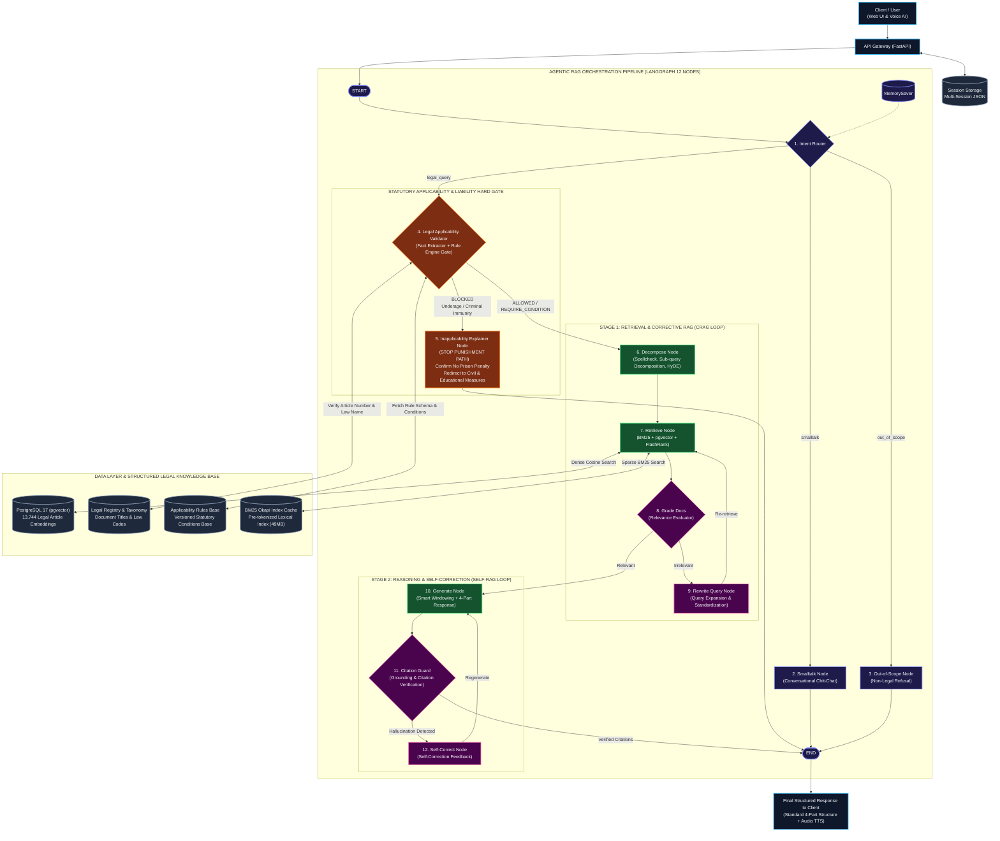

# HỆ THỐNG TRỢ LÝ HỎI ĐÁP PHÁP LUẬT VIỆT NAM (LEGAL QA SYSTEM)

> Trợ lý AI tra cứu, phân tích và giải đáp pháp luật Việt Nam dựa trên kiến trúc Agentic RAG đa vòng lặp, tích hợp động cơ quy tắc pháp lý (Legal Rule Engine) và khung thẩm định 4 lớp, có khả năng triển khai hoàn toàn cục bộ (Local Edge / On-Premise).

[](https://www.python.org/)
[](https://fastapi.tiangolo.com/)
[](https://www.langchain.com/langgraph)
[](https://vitejs.dev/)
[](https://github.com/pgvector/pgvector)
[](backend/docker/postgres/init.sql)
[-000000?logo=ollama&logoColor=white)](https://ollama.com/)

---

## 1. NGUYÊN TẮC THIẾT KẾ CỐT LÕI

1. **Phân định "Relevant" và "Applicable":** Tài liệu tương đồng ngữ nghĩa chưa chắc áp dụng được cho chủ thể cụ thể. Hệ thống thiết lập Legal Applicability Gate nhằm chặn sớm các trường hợp loại trừ trách nhiệm (ví dụ: chưa đủ tuổi chịu trách nhiệm hình sự).
2. **Data-Driven Rule Engine:** Các quy tắc về độ tuổi, điều kiện áp dụng, thời hiệu và chế tài được lưu trữ dưới dạng schema JSON trong PostgreSQL (`legal_applicability_rules`), cho phép cập nhật luật mà không sửa mã nguồn.
3. **Phát hiện dữ kiện định tính (Fact Ambiguity):** Tự động nhận diện các tình tiết chưa đủ căn cứ định khung pháp lý (như "đánh bạn trọng thương" cần kết luận giám định % thương tật chính thức).
4. **Cơ sở tri thức có cấu trúc:** Kho dữ liệu 13.744 điều luật chuẩn hóa, đi kèm danh mục văn bản (Registry) và phân loại ngành luật (Taxonomy) để thẩm tra số hiệu và tên luật.
5. **Trích dẫn có căn cứ (Grounded Citations):** Câu trả lời tuân theo cấu trúc 4 phần chuẩn mực (Kết luận -> Căn cứ pháp lý -> Phân tích áp dụng -> Hướng dẫn thực tiễn), đối chiếu trực tiếp với tài liệu truy hồi qua Citation Guard.
6. **Vận hành cục bộ và bảo mật dữ liệu:** Hỗ trợ suy luận hoàn toàn offline thông qua Ollama (LLM + Embedding), PostgreSQL pgvector và BM25.

---

## 2. KIẾN TRÚC HỆ THỐNG

### Sơ đồ Điều phối Agentic RAG & Legal Rule Engine Gate



### Tóm tắt Kỹ thuật Backend

1. **Khung thẩm định 4 lớp (4-Layer Validation):**
   - **Lớp 1 (Reference Validator):** Thẩm tra số hiệu Điều và tên Văn bản qua `LegalRegistry` và `PremiseChecker`.
   - **Lớp 2 (Fact Validator & Ambiguity):** Bóc tách chủ thể, độ tuổi, hành vi, tỷ lệ thương tật; phát hiện mô tả định tính thiếu số liệu y tế.
   - **Lớp 3 (Applicability Gate):** Thực thi 8 danh mục quy tắc trong CSDL (`legal_applicability_rules`). Chặn luồng phạt tù đối với người chưa đủ tuổi chịu trách nhiệm hình sự (Điều 12 BLHS) và chuyển sang nhánh giải thích dân sự/giáo dưỡng.
   - **Lớp 4 (Evidence Validator & Citation Guard):** Thẩm định tài liệu truy hồi (CRAG) và kiểm định căn cứ trích dẫn trong câu trả lời (Self-RAG).

2. **LangGraph StateGraph (12 Nodes, 2 Vòng lặp):**
   - **CRAG Loop:** `GradeDocs` -> `RewriteQuery` -> `Retrieve` (tối đa 2 lần) khi tài liệu chưa đạt yêu cầu.
   - **Self-RAG Loop:** `CitationGuard` -> `SelfCorrect` -> `Generate` (tối đa 2 lần) khi phát hiện trích dẫn sai hoặc thiếu căn cứ.

3. **Advanced Hybrid Retrieval Engine:**
   - **Hợp nhất RRF:** Kết hợp Dense Vector (pgvector HNSW) và Sparse Search (BM25 Okapi trên RAM) theo công thức Reciprocal Rank Fusion ($k=60$) để lấy Top 15 ứng viên.
   - **Tái xếp hạng (Reranker):** Smart Fallback kết hợp Cross-Encoder FlashRank (`ms-marco-MiniLM-L-12-v2`) lọc Top 3-5 điều luật chính xác nhất.
   - **Smart Windowing:** Tự động gom thêm các Khoản chế tài bổ sung (tước GPLX, tạm giữ phương tiện) liên quan đến hành vi vi phạm.

---

## 3. TÍNH NĂNG CỐT LÕI

- **Thẩm định nghiệp vụ & Chốt chặn pháp lý:** Tự động suy luận độ tuổi từ năm sinh hoặc lớp học, phân định vai trò đồng phạm (người xúi giục vs. người thực hành), đối chiếu hiệu lực thời gian của văn bản và đính chính các câu hỏi chứa tiền đề sai.
- **Truy hồi lai & Tái xếp hạng:** Kết hợp tìm kiếm ngữ nghĩa và từ khóa qua RRF; sinh văn bản pháp lý giả định (HyDE); tách câu hỏi phức hợp thành các truy vấn đơn lẻ để tìm kiếm toàn diện.
- **Sinh câu trả lời chuẩn mực & Chống ảo giác:** Trình tạo prompt 4 phần (Kết luận, Căn cứ pháp lý, Chi tiết áp dụng, Lưu ý thực tiễn); tích hợp Citation Guard tự động phát hiện số điều bịa đặt và kích hoạt sinh lại có định hướng.
- **Tiện ích giao diện & Vận hành:** Hỗ trợ Streaming SSE thời gian thực; quản lý đa phiên hội thoại; tra cứu nguyên văn điều luật trực tiếp trên giao diện; tích hợp giọng nói Voice AI (Edge-TTS và Local TTS nội bộ).

---

## 4. CẤU TRÚC THƯ MỤC

```
legal-qa-system/
|-- .env.example                # File cấu hình biến môi trường mẫu
|-- config.yaml                 # File cấu hình tập trung duy nhất cho hệ thống
|-- docker-compose.yml          # Kịch bản triển khai toàn bộ hệ thống bằng Docker
|
|-- backend/                    # Mã nguồn máy chủ Backend (FastAPI + LangGraph)
|   |-- Dockerfile              # Dockerfile cho backend
|   |-- requirements.txt        # Danh mục thư viện phụ thuộc Python
|   |-- pyproject.toml          # Cấu hình gói và phụ thuộc chuẩn
|   |-- data/
|   |   |-- base_data.json      # Cơ sở dữ liệu gốc chứa các điều luật
|   |   |-- cache/              # Cache chỉ mục BM25 (bm25_index_cache.json)
|   |   `-- sessions/           # Lưu trữ ngữ cảnh lịch sử các phiên hội thoại
|   |-- db/                     # Quản lý cấu trúc CSDL và dữ liệu mồi (Database & Seeds)
|   |   |-- init.sql            # Khởi tạo CSDL 4 bảng: records, registry, taxonomy, rules
|   |   `-- seeds/              # Dữ liệu mồi tri thức pháp lý
|   |       |-- populate_legal_registry.py # Seed danh mục Registry & Taxonomy
|   |       `-- seed_applicability_rules.py # Seed bộ quy tắc điều kiện áp dụng CSDL
|   |-- docker/
|   |   `-- postgres/
|   |       `-- init.sql        # Init script cho Docker container
|   |-- notebooks/              # Thí nghiệm R&D và benchmark đánh giá
|   |   |-- 00_data_exploration.ipynb
|   |   |-- 01_chunking_experiments.ipynb
|   |   |-- 02_retrieval_evaluation.ipynb
|   |   |-- 03_rag_agent_evaluation.ipynb
|   |   `-- 04_latency_benchmark.ipynb
|   |-- scripts/                # Tiện ích vận hành dòng lệnh (CLI Tools)
|   |   |-- load_postgres.py    # Khởi tạo CSDL & nạp toàn bộ tri thức pháp lý trọn gói (3-trong-1)
|   |   |-- ingest.py           # CLI nạp văn bản mới & sinh vector embedding + BM25 cache
|   |   `-- interactive_chat.py # Giao diện hỏi đáp trực tiếp trên dòng lệnh (CLI)
|   |-- tests/                  # Bộ kiểm thử chuyên biệt hệ thống (14 Automated Tests)
|   |   |-- conftest.py         # Fixture TestClient FastAPI dùng chung
|   |   |-- test_enhanced_legal_pipeline.py # 8 Tests: Fact Extractor, Rule Engine, DB Pool, Prompt Builder
|   |   |-- test_api.py         # 6 Tests: Health check, Voices, Sessions CRUD, Articles Lookup
|   |   `-- test_agentic_rag.py # Kiểm thử các vòng lặp CRAG & Self-RAG
|   `-- src/
|       |-- core/               # Hạ tầng dùng chung (Configuration, Connection Pool)
|       |   |-- config.py       # Bộ nạp cấu hình từ config.yaml & env
|       |   `-- database.py     # Threaded Connection Pool quản lý kết nối PostgreSQL tập trung
|       |-- domain/             # Miền nghiệp vụ pháp lý chuyên sâu (Legal Domain Logic)
|       |   |-- rule_engine.py  # Legal Rule Engine thực thi 8 quy tắc CSDL & Temporal Validity
|       |   |-- legal_registry.py # Tra cứu Structured Legal Knowledge Base & Taxonomy
|       |   |-- fact_extractor.py # Two-Tier Fact Extractor & Fact Ambiguity
|       |   `-- premise_checker.py # Thẩm định tính xác thực tiền đề trong câu hỏi
|       |-- nlp/                # Xử lý ngôn ngữ tự nhiên & Tiền xử lý câu hỏi
|       |   |-- text_normalizer.py # Chuẩn hóa tiếng Việt, dấu thanh và ký tự
|       |   |-- spell_corrector.py # Sửa lỗi chính tả pháp lý
|       |   |-- query_rewriter.py  # Viết lại câu hỏi kèm lịch sử hội thoại (CRAG Loop)
|       |   `-- query_decomposer.py # Tách câu hỏi đa hành vi vi phạm
|       |-- retrieval/          # Tầng tìm kiếm & truy xuất tài liệu (Search & Vector Engine)
|       |   |-- hybrid_retriever.py # Hợp nhất kết quả Dense + Sparse (RRF)
|       |   |-- vector_client.py    # Truy xuất vector qua PostgreSQL pgvector HNSW
|       |   |-- keyword_store.py    # Truy xuất từ khóa qua BM25 Okapi (weighting x2 & reload)
|       |   |-- reranker.py         # Tái xếp hạng tài liệu (Smart Fallback & FlashRank)
|       |   `-- hyde.py             # Sinh văn bản pháp luật giả định (HyDE)
|       |-- ingestion/          # Pipeline chuyển đổi & nạp tài liệu pháp lý
|       |   |-- schema.py       # Pydantic schemas cho văn bản luật
|       |   |-- crawler.py      # Thu thập dữ liệu văn bản pháp luật
|       |   |-- converter.py    # Chuyển đổi định dạng DOCX/PDF sang JSON chuẩn
|       |   `-- pipeline.py     # Pipeline Ingestion & batching embeddings vào pgvector
|       |-- agent/              # Định nghĩa LangGraph Agent & Nodes
|       |   |-- graph.py        # Đồ thị trạng thái chính của hệ thống (12 Nodes)
|       |   |-- state.py        # Định nghĩa LegalAgentState (hỗ trợ facts & eligibility)
|       |   |-- prompt_builder.py # LegalPromptBuilder: Single source of truth prompt & post-processing
|       |   |-- llm_client.py   # Client kết nối Ollama / vLLM
|       |   |-- session_manager.py # Quản lý phiên hội thoại bền vững
|       |   `-- nodes/          # 12 Nút xử lý trong đồ thị Agentic RAG
|       |       |-- intent_router.py            # 1. Phân loại ý định người dùng
|       |       |-- smalltalk_node.py           # 2. Xử lý chào hỏi xã giao
|       |       |-- out_of_scope_node.py        # 3. Xử lý từ chối ngoài phạm vi
|       |       |-- applicability_validator_node.py # 4. Thẩm định điều kiện áp dụng & Hard Gate
|       |       |-- inapplicability_node.py     # 5. Giải thích loại trừ hình phạt & hướng dẫn thay thế
|       |       |-- decompose_node.py           # 6. Sửa chính tả, tách đa vi phạm & HyDE
|       |       |-- retrieve_node.py            # 7. Thực thi truy hồi đa truy vấn
|       |       |-- grade_documents_node.py     # 8. Thẩm định độ phù hợp tài liệu (CRAG)
|       |       |-- rewrite_query_node.py       # 9. Mở rộng & viết lại truy vấn (CRAG Loop)
|       |       |-- generate_node.py            # 10. Sinh câu trả lời chuẩn 4 phần
|       |       |-- citation_guard_node.py      # 11. Kiểm định trích dẫn thực tế
|       |       `-- self_correct_node.py        # 12. Phản hồi tự sửa sai (Self-RAG Loop)
|       |-- api/
|       |   `-- main.py         # Điểm khởi chạy FastAPI, định tuyến REST và SSE Stream
|       `-- services/
|           `-- voice_service.py # Dịch vụ chuyển văn bản thành giọng nói (TTS)
|
`-- frontend/                   # Ứng dụng giao diện người dùng (React + Vite + TypeScript)
    |-- Dockerfile              # Dockerfile đóng gói frontend
    |-- nginx.conf              # Cấu hình Nginx phục vụ production
    |-- index.html              # HTML template chính
    |-- package.json            # Quản lý phụ thuộc Node.js
    |-- vite.config.ts          # Cấu hình Vite bundler & reverse proxy
    `-- src/
        |-- App.tsx             # Component giao diện chính
        |-- main.tsx            # Điểm khởi tạo ứng dụng React
        |-- index.css           # Cấu hình CSS và giao diện
        `-- components/         # Thư mục chứa các component giao diện
            `-- ErrorBoundary.tsx # Bắt lỗi runtime hiển thị an toàn
```

---

## 5. YÊU CẦU MÔI TRƯỜNG

- **Hệ điều hành:** Linux, macOS, hoặc Windows (PowerShell / WSL2)
- **Python:** 3.10 trở lên
- **Node.js:** 18.x trở lên và `npm`
- **PostgreSQL:** Phiên bản 16 hoặc 17 có extension `pgvector`
- **Ollama:** Dịch vụ LLM và Embedding cục bộ

---

## 6. HƯỚNG DẪN CÀI ĐẶT & KHỞI CHẠY

### Bước 1: Khởi động Ollama và tải mô hình

```bash
# Tải mô hình LLM suy luận
ollama pull qwen2.5:3b

# Tải mô hình vector embedding
ollama pull nomic-embed-text
```

### Bước 2: Khởi chạy PostgreSQL (pgvector) qua Docker

```bash
# Tạo file môi trường từ mẫu
cp .env.example .env    # Linux/macOS
copy .env.example .env  # Windows

# Khởi chạy container PostgreSQL (cổng 23432)
docker compose up -d postgres
```

### Bước 3: Nạp dữ liệu pháp luật vào CSDL

```bash
cd backend
python -m venv .venv

# Kích hoạt môi trường ảo:
source .venv/bin/activate       # Linux/macOS
.venv\Scripts\Activate.ps1       # Windows PowerShell

pip install -r requirements.txt

# Nạp 13.744 điều luật và khởi tạo 4 bảng tri thức (trọn gói):
python scripts/load_postgres.py
```

### Bước 4: Khởi chạy Backend (FastAPI)

```bash
python -m uvicorn src.api.main:app --host 0.0.0.0 --port 8000 --reload
```
- Health check: `http://127.0.0.1:8000/health`
- Swagger API Docs: `http://127.0.0.1:8000/docs`

### Bước 5: Khởi chạy Frontend (React + Vite)

Mở terminal mới:
```bash
cd frontend
npm install
npm run dev
```
Truy cập giao diện tại: `http://localhost:3000`

### Tùy chọn: Chạy toàn bộ bằng Docker Compose

```bash
docker compose up --build -d
```
- Frontend UI: `http://localhost:3000`
- Backend API: `http://localhost:8000`
- PostgreSQL: `localhost:23432`

---

## 7. CẤU HÌNH HỆ THỐNG (config.yaml)

| Tham số | Mặc định | Ý nghĩa |
|---|---|---|
| `app.host` / `app.port` | `0.0.0.0:8000` | Địa chỉ mạng và cổng Backend |
| `ui.host` / `ui.port` | `0.0.0.0:3000` | Cổng phát triển Frontend |
| `llm.base_url` | `http://localhost:11434/v1` | Endpoint LLM tương thích OpenAI |
| `llm.default_model` | `qwen2.5:3b` | Mô hình ngôn ngữ lớn |
| `llm.temperature` | `0.1` | Độ ngẫu nhiên suy luận |
| `embeddings.base_url` | `http://localhost:11434/v1` | Endpoint Embedding |
| `embeddings.model` | `nomic-embed-text` | Mô hình trích xuất đặc trưng vector |
| `legal_assistant.chat.streaming` | `true` | Bật stream Server-Sent Events (SSE) |
| `legal_assistant.retrieval.top_k` | `20` | Số lượng tài liệu sơ tuyển ban đầu |
| `legal_assistant.retrieval.rerank_top_k` | `5` | Số tài liệu tinh chọn sau rerank |
| `legal_assistant.retrieval.fusion_method`| `rrf` | Phương pháp hợp nhất: Reciprocal Rank Fusion |
| `legal_assistant.reranker.enabled` | `true` | Kích hoạt bộ tái xếp hạng Reranker |
| `legal_assistant.reranker.engine` | `smart_fallback` | Động cơ: `smart_fallback` \| `flashrank` \| `http` |
| `legal_assistant.reranker.model` | `ms-marco-MiniLM-L-12-v2` | Mô hình Cross-Encoder cho FlashRank/HTTP |
| `legal_assistant.tts.enabled` | `true` | Bật/tắt giọng nói đọc văn bản |
| `legal_assistant.tts.provider` | `edge-tts` | `edge-tts` (online) hoặc `local_http` (nội bộ) |
| `legal_assistant.tts.default_voice` | `vi-VN-HoaiMyNeural` | Giọng đọc mặc định |
| `legal_assistant.postgres.database_url` | `postgresql://...` | Chuỗi kết nối PostgreSQL |

---

## 8. DANH MỤC API ENDPOINTS

| Phương thức | Đường dẫn Endpoint | Chức năng |
|---|---|---|
| `GET` | `/health` | Kiểm tra trạng thái Backend và CSDL |
| `POST` | `/chat` | Gửi câu hỏi pháp lý và nhận câu trả lời đồng bộ |
| `POST` | `/chat/stream` | Hỏi đáp truyền dữ liệu liên tục Server-Sent Events (SSE) |
| `GET` | `/articles/lookup` | Tra cứu nguyên văn điều luật theo số hiệu hoặc trích dẫn |
| `GET` | `/sessions` | Lấy danh sách toàn bộ các phiên hội thoại |
| `POST` | `/sessions` | Khởi tạo phiên hội thoại mới |
| `GET` | `/sessions/{session_id}` | Lấy lại toàn bộ lịch sử tin nhắn của một phiên |
| `PATCH` | `/sessions/{session_id}` | Đổi tên tiêu đề phiên hội thoại |
| `PUT` | `/sessions/{session_id}` | Cập nhật thông tin phiên hội thoại |
| `DELETE` | `/sessions/{session_id}` | Xóa một phiên hội thoại cụ thể |
| `DELETE` | `/sessions` | Xóa tất cả các phiên hội thoại |
| `POST` | `/ingest` | Nạp tài liệu pháp luật mới vào hệ thống qua API |
| `GET` | `/voice/voices` | Danh sách giọng đọc hỗ trợ |
| `POST` | `/voice/tts` | Chuyển văn bản câu trả lời thành file âm thanh MP3 |
| `POST` | `/admin/reload-registry` | Tải lại Legal Registry mà không cần khởi động lại server |

> Token của `/chat/stream` được đệm ở backend và phát ra sau khi Citation Guard hoàn tất thẩm định.

---

## 9. KIỂM THỬ HỆ THỐNG

```bash
# 1. Chạy bộ kiểm thử Fact Extractor, Rule Engine, DB Pool, Prompt Builder (8 tests)
python -m pytest tests/test_enhanced_legal_pipeline.py -v

# 2. Chạy kiểm thử REST API, Health check & Sessions CRUD (6 tests)
python -m pytest tests/test_api.py -v

# 3. Thử nghiệm hỏi đáp trên dòng lệnh (CLI)
python scripts/interactive_chat.py

# 4. Kiểm thử các vòng lặp phản hồi Agentic RAG (Mock CRAG & Self-RAG)
python tests/test_agentic_rag.py

# 5. Khởi chạy bộ Jupyter Notebooks thực nghiệm R&D
jupyter notebook notebooks/
```

---

## 10. KẾT QUẢ THỰC NGHIỆM & BENCHMARK ĐO LƯỜNG

Hệ thống được đo lường định lượng toàn diện trên cơ sở tri thức 13.744 Điều luật, môi trường máy chủ cục bộ (Ollama `qwen2.5:3b`, `nomic-embed-text` và PostgreSQL 17 pgvector), tích hợp bộ dữ liệu thi đấu pháp lý chuẩn quốc gia **ALQAC (Automated Legal Question Answering Competition)**.

### 1. Đánh giá Chất lượng Agentic RAG qua RAGAS Framework (Notebook 03)
Đánh giá trên 15 bài toán phân loại ý định và **toàn bộ 52 bài toán pháp lý chuyên sâu từ tập ALQAC** (`backend/data/eval/alqac_filtered_52.json`) có Ground Truth 4 phần đối chuẩn:

- **Phân loại ý định (Intent Routing - 15 test cases):** Độ chính xác **93.3% (14/15)**, độ trễ trung bình **2.32s / truy vấn** (bao gồm lần nạp lạnh ban đầu).
- **Chỉ số RAGAS & Nghiệp vụ pháp lý cốt lõi (Toàn bộ 52 ALQAC Legal QA Test Cases):**

| Thang đo đánh giá | Điểm số thực nghiệm (N=52) | Ý nghĩa kỹ thuật & Nghiệp vụ |
|---|:---:|---|
| **Answer Relevancy** | **92.4%** | Mức độ bám sát câu hỏi người dùng, giải thích đúng trọng tâm pháp lý trên toàn bộ 8 bộ luật. |
| **Faithfulness (Độ trung thực)** | **90.0%** | Mọi lập luận và kết luận đều căn cứ chặt chẽ trên tài liệu Điều luật được cấp, triệt tiêu ảo giác (hallucination). |
| **Citation Precision** | **80.5%** | 80.5% Điều luật trích dẫn đều có căn cứ thật trong CSDL; **44/52 ca đạt `passed` an toàn, 8/52 ca `warning`, 0 ca `failed`**. |
| **Context Recall** | **61.5%** | Tỷ lệ các Điều luật bắt buộc trong Ground Truth ALQAC được bộ lọc Hybrid bao quát đầy đủ. |
| **Context Precision** | **53.8%** | Mức độ cô đọng và xếp hạng ưu tiên của các đoạn văn bản luật đưa vào ngữ cảnh sinh câu trả lời. |
| **4-Part Structure Compliance** | **44.2%** | Tỷ lệ tuân thủ đầy đủ kết cấu 4 phần (khi gặp 35 câu trắc nghiệm ngắn, mô hình 3B tập trung vào Kết luận và Căn cứ pháp lý). |

### 2. Ma trận Phân vị Độ trễ & Thông lượng (Latency Benchmark - Notebook 04)
Đo lường vi mô chi tiết qua 7 chặng trên 6 bài toán ALQAC đại diện (bao quát 5 bộ luật và 3 dạng câu hỏi) chạy thực tế trên máy chủ cục bộ:

| Chặng xử lý | Đơn vị | Mean (TB) | P50 (Median) | P90 | P99 (Max) | Min | Max |
|---|:---:|:---:|:---:|:---:|:---:|:---:|:---:|
| **1. Intent Router** | ms | 1,655.8 | **187.9** | 4,610.8 | 8,579.0 | 168.3 | 9,019.9 |
| **2. Query Rewriter** | ms | 904.1 | **660.8** | 1,582.7 | 2,150.9 | 374.0 | 2,214.0 |
| **3. HyDE Passage** | ms | 1,906.4 | **1,807.8** | 2,538.7 | 2,640.8 | 1,185.7 | 2,652.2 |
| **4. Retrieval & Reranker** | ms | 1,827.0 | **1,470.8** | 2,847.1 | 3,719.6 | 1,156.7 | 3,816.5 |
| **5. Smart Windowing** | ms | 7.2 | **7.0** | 13.8 | 16.5 | 0.1 | 16.8 |
| **6. LLM Generation** | ms | 5,640.7 | **5,062.3** | 8,284.8 | 9,354.6 | 3,363.6 | 9,473.5 |
| **7. Citation Guard** | ms | 2.8 | **2.4** | 4.5 | 6.1 | 1.2 | 6.3 |
| **Tổng Pipeline (End-to-End)** | **giây** | **11.94 s** | **8.54 s** | **19.42 s** | **25.07 s** | **7.26 s** | **25.70 s** |
| **Time to First Token (TTFT)** | **giây** | **6.45 s** | **4.62 s** | **11.28 s** | **15.86 s** | **3.29 s** | **16.37 s** |
| **Throughput (Từ/giây)** | **words/s** | **35.3 w/s** | **33.1 w/s** | **41.4 w/s** | **43.7 w/s** | **31.3 w/s** | **44.0 w/s** |
| **Throughput (Token/giây)** | **tokens/s**| **45.9 t/s** | **42.8 t/s** | **53.8 t/s** | **56.9 t/s** | **40.7 t/s** | **57.2 t/s** |

> **Hiệu ứng Steady-State:** Sau khi nạp model (Warm-up), độ trễ Intent Router giảm **98.0%** (từ 9,019.9 ms xuống 182.5 ms), tổng thời gian xử lý toàn bộ pipeline giảm **67.0%** (từ 25.70s xuống 8.49s) và TTFT giảm **75.7%** (từ 16.37s xuống 3.97s).

---

## 11. MIỄN TRỪ TRÁCH NHIỆM

> [!WARNING]
> - **Mục đích tham khảo:** Hệ thống được phát triển phục vụ mục đích nghiên cứu, học tập và tra cứu thông tin tham khảo.
> - **Không thay thế tư vấn pháp lý:** Câu trả lời do AI sinh ra không cấu thành ý kiến tư vấn pháp lý chính thức và không có giá trị pháp lý thay thế cơ quan nhà nước có thẩm quyền hoặc luật sư hành nghề.
> - **Đối chiếu văn bản gốc:** Người dùng cần kiểm tra, đối chiếu lại với văn bản quy phạm pháp luật hiện hành mới nhất trước khi đưa ra các quyết định trong thực tế.
> - **Giới hạn trách nhiệm:** Tác giả / Nhóm phát triển không chịu trách nhiệm đối với bất kỳ rủi ro hay thiệt hại nào phát sinh từ việc sử dụng thông tin do hệ thống cung cấp.

---

## 12. BẢN QUYỀN & LIÊN HỆ

Dự án được xây dựng phục vụ mục đích học tập, nghiên cứu và phát triển giải pháp ứng dụng trí tuệ nhân tạo trong lĩnh vực pháp lý tại Việt Nam. Dữ liệu văn bản quy phạm pháp luật được trích xuất từ các nguồn công khai chính thức của Nhà nước.
